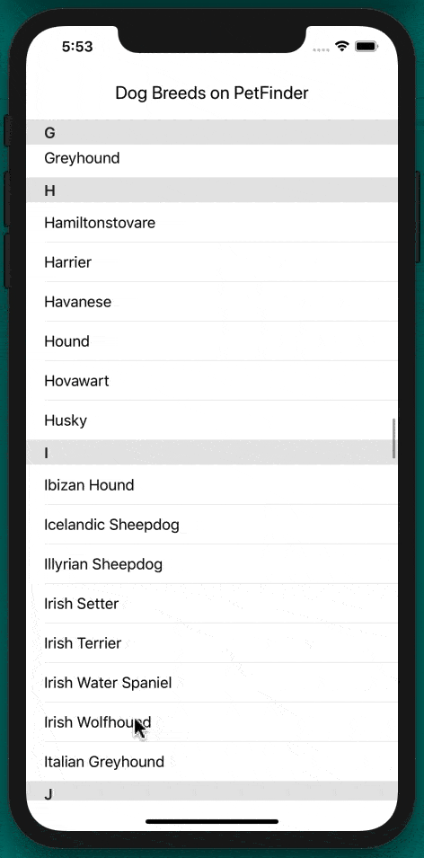

# PetFinder

A native iOS app for demonstrating REST API calls using tokens, asynchronous communication and a dispatch group. 

The Petfinder REST API at https://www.petfinder.com/developers/ is used. Obtain a client ID and client secret to use the REST API. Place the credentials in the API-Keys.swift file. Without credentials, the app will display provided test data.

**Technical Info:** \
Xcode11 project written in Swift 5 for iOS\
REST API with token, Asynchronous communication, DispatchGroup, Delegation pattern,\
URLSession, JSONDecoder, Decodable protocol, Dictionaries, Tuples, Nested Arrays,\
TableViews with section detail and section headers

**See Also:** \
[Quickies - a variety of example iOS apps](https://github.com/PepperoniJoe/Quickies)\
 [Make Icons Swiftly - used to generate app icon sets
 ](https://github.com/PepperoniJoe/Make-Icons-Swiftly)
 
**Author:** \
Marcy Vernon [@MarcyVernon](https://twitter.com/MarcyVernon)

**License:** \
"PetFinder" app is under the MIT license. See [LICENSE](/LICENSE) for more information.
